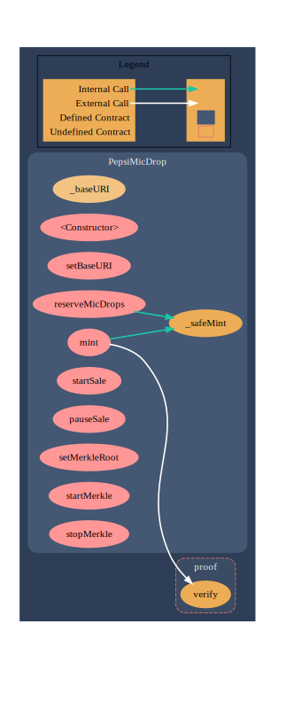

# Pepsi NFT Contract Examination

* SPDX License Identifier is the first line after comment. It indicates how other people can use this [code](https://github.com/ErdemOzgen/Solidity-Learning-Archive/blob/03ebac2dd7d04cc1d87e78aae1869b0eb60d3209/BooksAndCodes/NFTContractExamples/PepsiNFTExamination.sol#L36).

* Solidity Version lets the compiler translate the code correctly, and then the EVM can understand. [Code](https://github.com/ErdemOzgen/Solidity-Learning-Archive/blob/03ebac2dd7d04cc1d87e78aae1869b0eb60d3209/BooksAndCodes/NFTContractExamples/PepsiNFTExamination.sol#L37)

* Import ERC-721 contracts then the Pepsi NFT contract will use the ERC-721 contract as its blueprint. [Code](https://github.com/ErdemOzgen/Solidity-Learning-Archive/blob/03ebac2dd7d04cc1d87e78aae1869b0eb60d3209/BooksAndCodes/NFTContractExamples/PepsiNFTExamination.sol#L39)

* 

 

* PepsiMicDrop is the NFT contract we will further discuss in the next section. It has three subparts: (1)State Variables (2)Constructor (3)Functions.

* State variables are variables whose values are permanently stored in contract storage.

* Constructor is a special function that is only executed upon contract creation. You can run the contract initialization code.

* Functions are self-explanatory. Most functions are used to set or get state values.

## (1) Constructor [Code](https://github.com/ErdemOzgen/Solidity-Learning-Archive/blob/03ebac2dd7d04cc1d87e78aae1869b0eb60d3209/BooksAndCodes/NFTContractExamples/PepsiNFTExamination.sol#L64)
```solidity
constructor() ERC721("Pepsi Mic Drop", "PEPSIMICDROP") {
    reserveMicDropsId = 1; // item 1-50
    micDropsId = 51; // item 51-1893
}
```

The constructor takes 2 inputs:

1. “Pepsi Mic Drop” is the NFT token name
2. “PEPSIMICDROP” is the token symbol.

The assignment happens in the ERC721 contract code, which the contract imports at [line](https://github.com/ErdemOzgen/Solidity-Learning-Archive/blob/03ebac2dd7d04cc1d87e78aae1869b0eb60d3209/BooksAndCodes/NFTContractExamples/PepsiNFTExamination.sol#L64)  It is the beauty of inheritance, and we do not need to redo it.
<br>
Inside the constructor, we can see 2 state variables get new values, reserveMicDropsId, and micDropsId. Why they are needed? In this NFT drop, Pepsi kept the first 50 NFTs to themselves, so the NFTs that are publicly available start from id 51.

## (2) Mint [Code](https://github.com/ErdemOzgen/Solidity-Learning-Archive/blob/03ebac2dd7d04cc1d87e78aae1869b0eb60d3209/BooksAndCodes/NFTContractExamples/PepsiNFTExamination.sol#L73)

```solidity

function mint(bytes32[] memory proof, bytes32 leaf) public returns (uint256) {
    // merkle tree
    if (merkleEnabled) {
        require(keccak256(abi.encodePacked(msg.sender)) == leaf, "This leaf does not belong to the sender");
        require(proof.verify(merkleRoot, leaf), "You are not in the list");
    }

    require(saleStarted == true, "The sale is paused");
    require(msg.sender != address(0x0), "Public address is not correct");
    require(alreadyMinted[msg.sender] == false, "Address already used");
    require(micDropsId <= maxMint, "Mint limit reached");

    _safeMint(msg.sender, micDropsId++);

    alreadyMinted[msg.sender] = true;

    return micDropsId;
}
```
#### Part 1 — Merkle Proof

There are two inputs of the mint function, proof, and leaf. They are used for Merkle Proof from [lines](https://github.com/ErdemOzgen/Solidity-Learning-Archive/blob/03ebac2dd7d04cc1d87e78aae1869b0eb60d3209/BooksAndCodes/NFTContractExamples/PepsiNFTExamination.sol#L75). Essentially, it checks if a user is qualified to mint the NFT. There is a concept called whitelist. Sometimes you have to get into this whitelist, to be able to mint NFTs later. Please check this [article](https://medium.com/@ItsCuzzo/using-merkle-trees-for-nft-whitelists-523b58ada3f9), which gives a comprehensive explanation of Merkle Proof.

#### Part 2 — Prerequisites

[Prerequisites](https://github.com/ErdemOzgen/Solidity-Learning-Archive/blob/03ebac2dd7d04cc1d87e78aae1869b0eb60d3209/BooksAndCodes/NFTContractExamples/PepsiNFTExamination.sol#L80) part of code.

(1) Before the NFT started to sell, the state variable saleStarted is set to false. So it will not pass the check-in line. When the sale begins, the contract owner can call the function startSale() to change the value of saleStarted.
```Solidity
require(saleStarted == true, "The sale is paused");
```

(2) This check makes sure the user address is not 0x0. 0x0 is the Ethereum genesis address, and no user will use it. [Look for genesis address check](https://www.finder.com.au/why-the-ethereum-genesis-address-holds-over-500m-worth-of-tokens#:~:text=Burning%20tokens%20by%20sending%20them,their%20tokens%20to%20the%20address.)
```Solidity
require(msg.sender != address(0x0), "Public address is not correct");
```
(3) In Pepsi Drop, each address can only mint one NFT. alreadyMinted is a state variable in mapping type, like a dictionary, that keeps track of all addresses that minted the NFT.
```Solidity
require(alreadyMinted[msg.sender] == false, "Address already used");
```
(4) There is a limited supply, up to 1983 NFTs. This checks if all NFTs have been claimed. micDropsId is the unique token id we discussed above.
```Solidity
require(micDropsId <= maxMint, "Mint limit reached");
```

#### Part 3 — The actual mint. [Code](https://github.com/ErdemOzgen/Solidity-Learning-Archive/blob/03ebac2dd7d04cc1d87e78aae1869b0eb60d3209/BooksAndCodes/NFTContractExamples/PepsiNFTExamination.sol#L85)

This is where mint actually happens. The good news is we do not need to implement it because ERC-721 already did this.

```Solidity
_safeMint(msg.sender, micDropsId++);
```
To mint, we call the function _safemint() with the user’s wallet address and the unique token id, and that’s it. Under the hood, there is a state variable (like a dictionary) that keeps track of the ownership of each token. By calling _safemint() function, we update this state variable, assign or change the ownership of the corresponding token.

One note here, the state variable micDropId represents token id, and it increments by 1 right after each mint.

#### Part 4 — Update Minted Address [Code](https://github.com/ErdemOzgen/Solidity-Learning-Archive/blob/03ebac2dd7d04cc1d87e78aae1869b0eb60d3209/BooksAndCodes/NFTContractExamples/PepsiNFTExamination.sol#L87)

This line ensures whoever successfully minted an NFT gets recorded.

#### Part 5 — Return [Code](https://github.com/ErdemOzgen/Solidity-Learning-Archive/blob/03ebac2dd7d04cc1d87e78aae1869b0eb60d3209/BooksAndCodes/NFTContractExamples/PepsiNFTExamination.sol#L89)

After minting, the token id is returned to the frontend.

#### (3) Update URI [Code](https://github.com/ErdemOzgen/Solidity-Learning-Archive/blob/03ebac2dd7d04cc1d87e78aae1869b0eb60d3209/BooksAndCodes/NFTContractExamples/PepsiNFTExamination.sol#L69)

```Solidity
function setBaseURI(string memory _baseUri) public onlyOwner {
    baseURI = _baseUri;
}
```

As you already know, each NFT has its URI. And this is the function used to change the base URI.

The base URI is the mutual part among each NFT’s URI. By default, the URI is baseURI/tokenId. The reason why we set baseURI is that it saves gas fees. Imagine if you set URI for each NFT that is extremely expensive.

You can change how to combine baseURI and tokenId, by overriding the function tokenURI defined in the ERC-721 contract. For example, you can do something like baseURI/tokenId + ‘.json’ if that is how the URI is formatted.

You might wonder, what are public and onlyOwner. These are function modifiers, which define the condition for a function to run. public means ‘inside and outside of the contract’, access to all. After the deployment, we interact with the contract through the website (more specifically, JavaScript), this is what public means. onlyOwner means only the contract owner can call this function. Of course, we only want the contract owner to have the capability to change the token URI.

