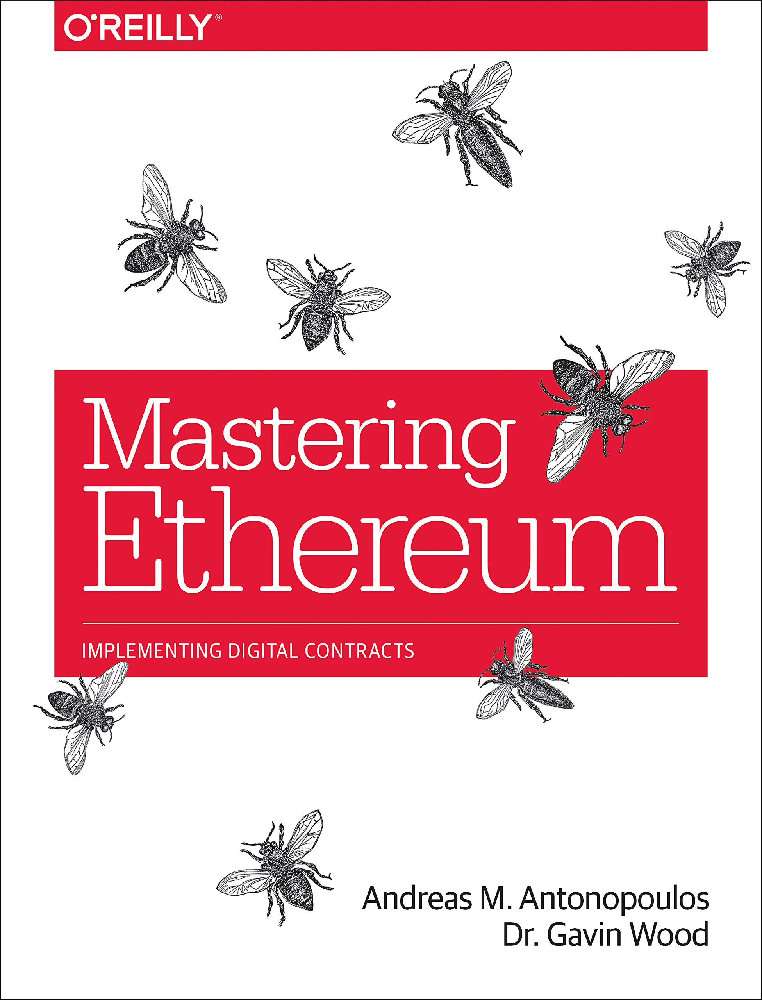

# Ethereum-Learning-Archive
Notes about Ethereum, Smart contracts and DApps


# Books and Resource
<div>

</div>


# Docs
<br>
Ethereum documentation<br>
* [ETH Docs Link](https://ethereum.org/en/developers/docs/)
* [Solidity By Example](https://solidity-by-example.org/)
* [Solidity Doc](https://docs.soliditylang.org/en/v0.8.11/)
<br>


# Video
<br>
Solidity, Blockchain, and Smart Contract Course – Beginner to Expert Python Tutorial / freeCodeCamp.org<br>
[Youtube Link](https://www.youtube.com/watch?v=M576WGiDBdQ&ab_channel=freeCodeCamp.org)


# Table of Contents

## Mastering Ethereum
* [Source Code](./Books/MasETH/README.md)
* Notes About Book
  
## Solidity by Example
* [Source Code](./Books/SolidityExample)
* Notes About Book
* [Original link](https://solidity-by-example.org/)

## Solidity Archive
* [Source Code](https://github.com/ErdemOzgen/)
* Notes About Book


# License

[](https://opensource.org/licenses/MIT)

# Buy Me Coffee


``` 0xd20E868d12E3f9dA8aC396e81a2Ec628A86100aF ```
